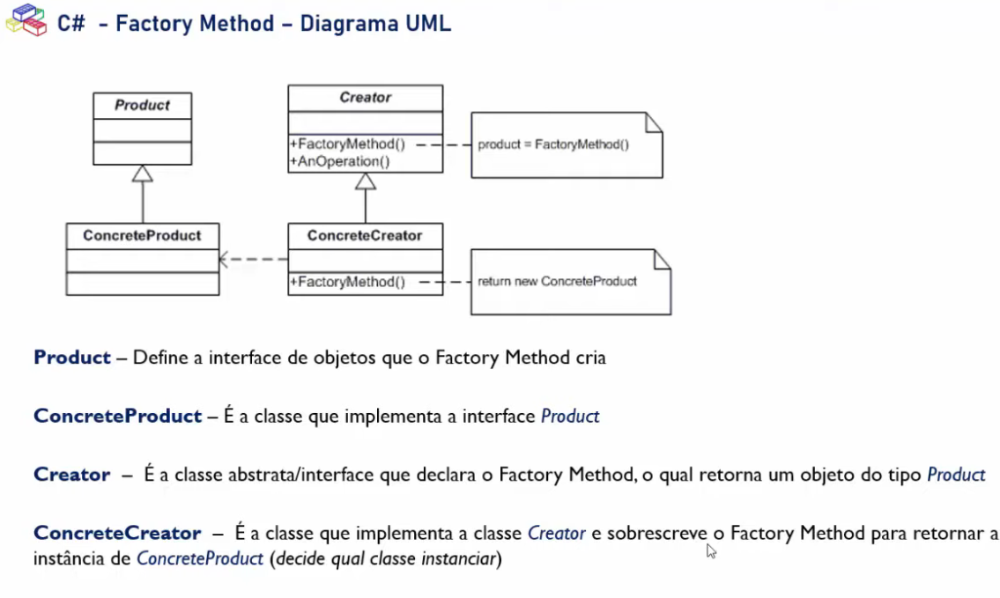

# _Factory Method_

### Propósito
   * Sua intenção é definir uma interface para criar objetos mas permitir que as subclasses
     decidam qual instanciar ou seja, tem como objetivo permitir que o cliente não precise
     saber quais tipos de objetos serão criados.
   * Usa herança e depende de uma subclasse para tratar com a instancia do objeto desejado.
   * Ele tem o mesmo objetivo que o padrão **simple factory.**
   * É interessante quando você não sabe bem qual é o tipo do objeto que será usado.

### Uml do factory method

### Vantagens
* Remoção do forte acoplamento entre as classes
* Encapsulamento do código que varia (instanciação da classe) em um unico local
* Princípio aberto/fechado (**Solid**). Você pode introduzir novos tipos de produtos no programa sem quebrar 
  o código cliente existente.  

### Desvantagens
* O código pode se tornar mais complicado, pois você precisa introduzir muitas subclasses novas para implementar o 
padrão. O melhor cenário é quando você está introduzindo o padrão em uma hierarquia existente de classes criadoras.

### Referencias:
 - https://www.youtube.com/watch?v=b5ESG2pS94o&t=1755s
 - https://refactoring.guru/pt-br/design-patterns/factory-method
 - https://www.youtube.com/watch?v=cSFSTqzEg48
 

 
 